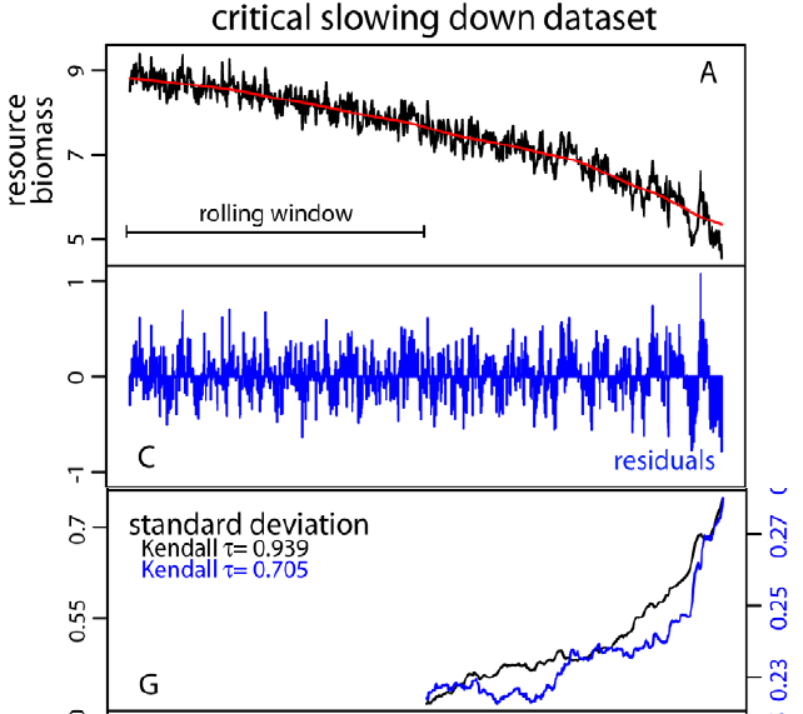
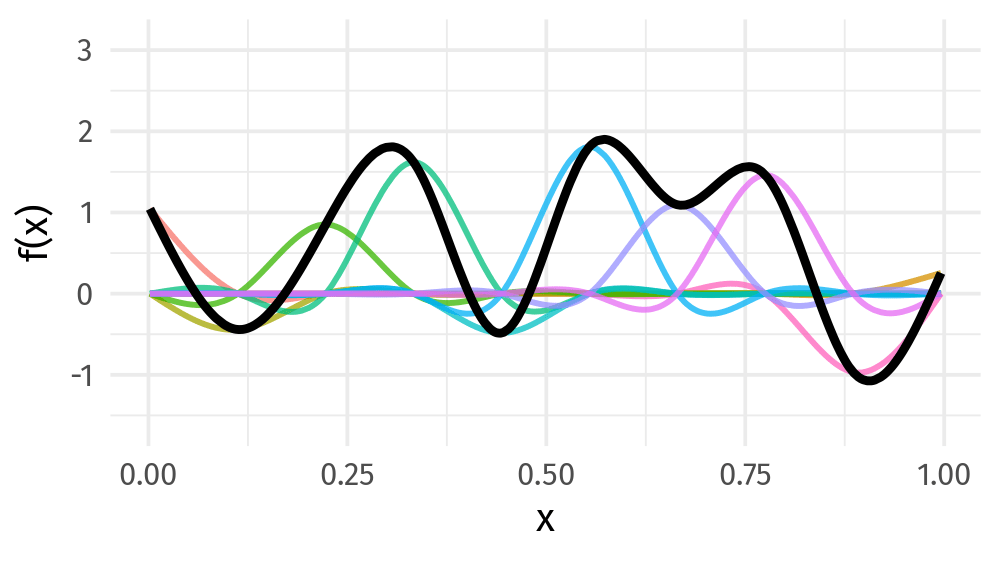
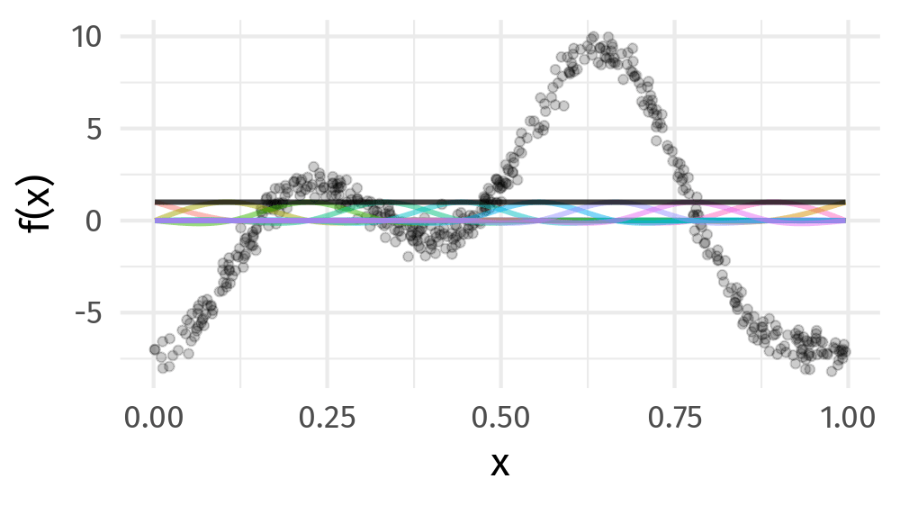

```{r setup, include=FALSE, cache=FALSE}
options(htmltools.dir.version = FALSE)
knitr::opts_chunk$set(cache = TRUE, dev = 'svg', echo = FALSE, message = FALSE, warning = FALSE,
                      fig.height=6, fig.width = 1.777777*6)

library("curl")
library("ggplot2")
library("dplyr")
library("tibble")
library('tidyr')
library('mgcv')
library('forcats')
library('mvnfast')
library('purrr')
library('gganimate')
library('gratia')
library('readr')
library('cowplot')
theme_set(theme_minimal(base_size = 14, base_family = 'Fira Sans'))
library('readxl')
library('here')

## constats
anim_width <- 1000
anim_height <- anim_width / 1.77777777
anim_dev <- 'png'
anim_res <- 200
```

### Land acknowledgment

* This work was start at University of Regina, on Treaty 4 lands

### Funding

.row[

.col-4[
.center[]
]

.col-4[
.center[]
]

.col-4[
.center[]
]

]

### Data

* Peter Leavitt (URegina) for the Lake 227 pigment data
* The pigment samples were collected from Lake 227 in the ELA, which is on Treaty 3 lands

### Slides

* [bit.ly/paleoecogen-gavin](http://bit.ly/paleoecogen-gavin) &copy; Simpson (2020&ndash;2022) [](http://creativecommons.org/licenses/by/4.0/)

???

This research was conducted while I was at the University of Regina, which is situated on the territories of the nay-hi-yuh-wuk (Cree; nêhiyawak), uh-nish-i-naa-payk (Salteaux; Anihšināpēk), Dakota, Lakota, and Nakoda, and the homeland of the Métis/Michif Nation.

The fossil pigment data I will talk about later were collected by my colleague at the University of Regina, Dr. Peter Leavitt, at Lake 227 in the Experimental Lakes Area in northern Ontario, which is on Treaty 3 lands, the territory of the Anishinaabe Nation.

---
class: inverse middle center big-subsection

# Resilience

---

# Alternative stable states

.row[

.col-9[
Under range of conditions multiple ecosystem states may exist

Stability landscapes depict equilibria and basins of attraction

Valleys are stable states

External conditions alter the stability landscape

Disturbances can kick a system between states

Variance used as EWS of impending state change
]

.col-3[
.center[
```{r ass}

```
]
.smaller[Scheffer et al Nature 2001]
]
]

---

# Variance as resilience

Intuitive & key descriptor of ecosystem state & community dynamics

.row[
.col-6[
.center[
```{r high-resilience}
knitr::include_graphics('./resources/scheffer-2012-high-resilience.jpg')
```
]
]

.col-6[
.center[
```{r low-resilience}
knitr::include_graphics('./resources/scheffer-2012-low-resilience.jpg')
```
]
]
.col-12[
.small[Source: Scheffer *et al* Science (2012)]
]
]

???

The variance is an important measure of ecosystem state & community dynamics

Ecologists have linked variance with coexistence of populations and variance can be interpreted in terms of resilience theory

Here I'm showing two cartoons;

A: in the high resilience state the ecosystem returns rapidly to the equilibrium following perturbation and hence has low variance

B: in the low resilience state, where the basin of attraction has become shallower, the ecosystem takes longer to return to equilibrium following perturbation and hence exhibits high variance

Variance, however, is much harder to estimate from data

---

# Resilience

Resilience has (too) many definitions

--

> as the time required for an ecosystem to return to an equilibrium or steady-state following a perturbation

--

Some ecologists would use that definition for *stability*

Buzz Holling referred to this as *engineering resilience*

--

If you don't buy any of that:

Phenomenologically, community variance is a useful thing to know&hellip;

--

&hellip;?

???

We could (and many people have) spent decades quibbling about what "resilience" is and how to define it

From a phenomenological viewpoint, I hope we can agree that the variance of a community tells us something about the dynamics of that community and change in variance tells us something about changes in those dynamics over time --- and that is something useful

---

# How do ecologists compute variance?

Using metrics

--

.bigger[
🤬
]

--

Ecologists get a number and do things with it

Typically brute force inference

--

Statisticians want to know the properties of this novel estimator

Typically brute forcing inference is fraught with problems


---

# Moving windows

.row[
.col-6[

Moving window approach:

1. detrend
2. choose window size
3. estimate variance
4. move window 1 time step
5. repeat 3. & 4. until done
6. look for trend

]

.col-6[
.center[
```{r moving-window}

```
]
.small[Modified from Dakos *et al* (2012) PLOS One]
]
]

???

One way to estimate the variance of a series is by using a moving window

Here the analyst first detrends the time series

Choose an appropriate window size

Starting from the beginning of the series calculate the variance of the observations in the window

Move the window along one time step and repeat 3 and 4 until you get to the end of the series

A trend in the resulting variance time series is estimated using Kendall's rank correlation tau

In this example the interest was in the end of the series so they right-aligned the window meaning they had to observe half the series before they could calculate the variance

---

# Problems

*Ad hoc*

* How to detrend (method, complexity of trend, ...)
* What window width?

Ideally regularly spaced data

* What to do about gaps, missing data, irregularly spaced data?

Statistical testing hard

* Kendall's $\tau$ assumes independence
* Surrogate time series assumes regular sampling, sensitive to choice of ARMA

???

The whole approach is *ad hoc* with many knobs to twiddle &mdash; how do you detrend the series? what width of window should be used?

Suited to regularly spaced data so you have the same number of observations in each window, but what about series with data gaps, missing observations, or data that are irregularly spaced?

Statistical inference is very hard; Kendall's tau assumes the data are independence but they can't be because of the moving window. Sometime surrogate time series are used to assess significance of the trend in variance; Surrogate time series are series generated with known properties that don't have a change in variance, but these approaches rely on classical techniques like ARMA models which only work for regularly spaced data and the test is sensitive to choice of orders in the ARMA

---
class: inverse middle center big-subsection

# Distributional Models

---
class: inverse middle center big-subsection

# Mean

???

The mean

When we analyze data we mostly focus on this property of our data

With summary statistics we often talk about the average of a set of values

Or in a statistical model we might estimate expected change in the response for some change in one or more covariates

Or we may be interested in estimating the trend in a data series where the trend described how the expected value of y changes over time


---
class: inverse middle center big-subsection

# Variance

???

There are other important properties of data however and in the short case study I want to talk about the variance & how we can use statistical models to investigate changes in the variance of ecosystems over time

---

# Parameters beyond the mean

```{r gaussian-distributions-plt}
x <- seq(8, -8, length = 500)
df <- data.frame(density = c(dnorm(x, 0, 1), dnorm(x, 0, 2), dnorm(x, 2, 1), dnorm(x, -2, 1)),
                 x = rep(x, 4),
                 distribution = factor(rep(c("mean = 0; var = 1", "mean = 0; var = 4",
                                             "mean = 2; var = 1", "mean = -2; var = 1"), each = 500),
                                       levels = c("mean = 0; var = 1", "mean = 0; var = 4",
                                                  "mean = 2; var = 1", "mean = -2; var = 1")))
plt1 <- ggplot(subset(df, distribution %in% c("mean = 0; var = 1", "mean = 0; var = 4")),
               aes(x = x, y = density, colour = distribution)) +
    geom_line(size = 1) + theme(legend.position = "top") +
    guides(col = guide_legend(title = "Distribution", nrow = 2, title.position = "left")) +
    labs(x = 'x', y = "Probability density")

plt2 <- ggplot(subset(df, distribution %in% c("mean = 2; var = 1", "mean = -2; var = 1")),
               aes(x = x, y = density, colour = distribution)) +
    geom_line(size = 1) + theme(legend.position = "top") +
    guides(col = guide_legend(title = "Distribution", nrow = 2, title.position = "left")) +
    labs(x = 'x', y = "Probability density")

##plt <- plot_grid(plt2, plt1, ncol = 2, align = "vh")
plt <- plt2 + plt1
plt
```

???

To do this we'll need models for the variance of a data set

If we think of the Gaussian distribution that distribution has two parameters, the mean and the variance

In linear regression we model the mean of the response at different values of the covariates, and assume the variance is constant at a value estimated from the residuals

In the left panel I'm showing how the Gaussian distribution changes as we alter the mean while keeping the variance fixed, while in the right panel I keep the mean fixed but vary the variance &mdash; the parameters are independent

---

# Distributional models

.medium[
$$y_{i} | \boldsymbol{x}_i \boldsymbol{z}_i \sim \mathcal{D}(\vartheta_{1}(\boldsymbol{x}_i), \ldots, \vartheta_{K}(\boldsymbol{x}_i))$$
]

For the Gaussian distribution

* $\vartheta_{1}(\boldsymbol{x}_i) = \mu(\boldsymbol{x}_i)$

* $\vartheta_{2}(\boldsymbol{z}_i) = \sigma(\boldsymbol{z}_i)$

Provide a list of formulas, one per parameter

```{r gaulss-code, eval = FALSE, echo = TRUE}
m <- gam( list( y ~ s(time),          # <- formula for mean
                  ~ s(time) ),        # <- formula for variance 
          data = df, method = "REML", family = gaulss())
```

???

Instead of treating the variance as a nuisance parameter, we could model both the variance **and** the mean as functions of the covariates

This is done using what is called a *distributional model*

In this model we say that the response values y_i, given the values of one or more covariates x_i follow some distribution with parameters theta, which are themselves functions of one or more covariates

For the Gaussian distribution theta 1 would be the mean and theta 2 the variance (or standard deviation)

We do not need to restrict ourselves to the Gaussian distribution however

---

# The Gamma distribution

```{r gamma-dist}
shape <- c(2,2,3,3,5,5)
scale <- c(2,4,2,1,1,0.5)
x <- seq(0, 20, length.out = 500)
df <- as_tibble(as.data.frame(mapply(dgamma, shape, scale, MoreArgs = list(x = x))))
names(df) <- paste('shape =', shape, ', scale =', scale)
df <- add_column(df, x = x, row = seq_len(nrow(df)))
df <- gather(df, 'distribution', 'density', -row, -x)
plt <- ggplot(df, aes(x = x, y = density, colour = distribution)) +
    geom_line(lwd = 1) + guides(colour = "none") +
    scale_color_discrete(name = "") + ylim(0, 1.5) +
    labs(y = "Probability Density")
plt
```

???

The gamma distribution would be more appropriate for describing the pigment data as it allows for positive continuous values, where those values are skewed, with some large values

Here I'm showing different types of gamma distribution that vary in the mean and their variance and we should note that unlike the Gaussian distribution, we cannot change the mean without also changing the variance of the gamma distribution

---
class: inverse middle center big-subsection

# Simulated data

---

# Simulated data

Well-studied model of harvesting and overexploitation

Resource biomass $x$ grows logistically and is harvested according to

$$dx = \left(r x \left(1 - \frac{x}{K} \right) - c \frac{x^2}{x^2 + h^2} \right) dt + \sigma x dW$$

.row[

.col-6[
* $r$ is growth rate
* $K$ carrying capacity
* $h$ is the half-saturation constant

]

.col-6[
* $c$ grazing rate
* $dW$ is a white noise process with intensity $(\sigma x)^2 / dt$
]

]
Deterministic case as $c$ crosses a threshold $c \approx 2.604$ we have a critical transition

---

# Simulated data

```{r simulate-data, cache = TRUE}
sim2 <- function(x0, r = 1, h = 1, K = 10, sigma = 0.5, T = 1000, C = c(1, 3)) {
    C <- seq(C[1], C[2], length.out = T+1)
    x <- numeric(T+1)
    x[1] <- x0

    for (i in seq_len(T) + 1) {
        p1 <- r * (x[i-1] * (1 - (x[i-1] / K)))
        x2 <- x[i-1]^2
        dW <- rnorm(1, sd = sigma)
        p2 <- (C[i-1] + dW) * (x2 / (x2 - h^2))
        dx <- (p1 - p2)
        x[i] <- x[i-1] + dx
    }

    x
}

set.seed(42)
frossard <- sim2(x0 = 8, T = 1000, C = c(1, 2.7))
frossard[frossard<0 | !is.finite(frossard)] <- 0
max_t <- 865
sim_data <- tibble(t = seq_len(max_t),
                   y = frossard[seq_len(max_t)])
```

```{r plot-simulated-data}
ggplot(sim_data, aes(x = t, y = y)) +
    geom_line() +
    labs(x = "Time", y = "Biomass")
```

---

# Distributional GAMs

Fit three distributional GAMs

1. A basic GAM with constant variance

2. A Gaussian distributional GAM with

$$\vartheta_{\mu} = \beta_0 + f(\mathtt{time})$$
$$\vartheta_{\sigma} = \beta_0 + f(\mathtt{time})$$

3. A Gamma distributional GAM with

$$\vartheta_{\mu} = \beta_0 + f(\mathtt{t})$$
$$\vartheta_{\alpha} = \beta_0 + f(\mathtt{t})$$

```{r fit-distributional-gams, cache = TRUE}
m1 <- gam(y ~ s(t), data = sim_data, method = "REML")
m2 <- gam(list(y ~ s(t),
                 ~ s(t, k = 5)),
          data = sim_data, method = "REML",
          family = gaulss())
m3 <- gam(list(y ~ s(t),
                 ~ s(t, k = 5)),
          data = sim_data, method = "REML",
          family = gammals())
```

---

# Generalized Additive Models

<br />


.references[Source: [GAMs in R by Noam Ross](https://noamross.github.io/gams-in-r-course/)]

???

GAMs are an intermediate-complexity model

* can learn from data without needing to be informed by the user
* remain interpretable because we can visualize the fitted features

---
class: inverse middle center large-subsection

# GAMs fit wiggly functions

```{r smooth-fun-animation, results = FALSE}
f <- function(x) {
    x^11 * (10 * (1 - x))^6 + ((10 * (10 * x)^3) * (1 - x)^10)
}

draw_beta <- function(n, k, mu = 1, sigma = 1) {
    mvnfast::rmvn(n = n, mu = rep(mu, k), sigma = diag(rep(sigma, k)))
}

weight_basis <- function(bf, x, n = 1, k, ...) {
    beta <- draw_beta(n = n, k = k, ...)
    out <- sweep(bf, 2L, beta, '*')
    colnames(out) <- paste0('f', seq_along(beta))
    out <- as_tibble(out)
    out <- add_column(out, x = x)
    out <- pivot_longer(out, -x, names_to = 'bf', values_to = 'y')
    out
}

random_bases <- function(bf, x, draws = 10, k, ...) {
    out <- rerun(draws, weight_basis(bf, x = x, k = k, ...))
    out <- bind_rows(out)
    out <- add_column(out, draw = rep(seq_len(draws), each = length(x) * k),
                      .before = 1L)
    class(out) <- c("random_bases", class(out))
    out
}

plot.random_bases <- function(x, facet = FALSE) {
    plt <- ggplot(x, aes(x = x, y = y, colour = bf)) +
        geom_line(lwd = 1, alpha = 0.75) +
        guides(colour = "none")
    if (facet) {
        plt + facet_wrap(~ draw)
    }
    plt
}

normalize <- function(x) {
    rx <- range(x)
    z <- (x - rx[1]) / (rx[2] - rx[1])
    z
}

set.seed(1)
N <- 500
data <- tibble(x     = runif(N),
               ytrue = f(x),
               ycent = ytrue - mean(ytrue),
               yobs  = ycent + rnorm(N, sd = 0.5))

k <- 10
knots <- with(data, list(x = seq(min(x), max(x), length = k)))
sm <- smoothCon(s(x, k = k, bs = "cr"), data = data, knots = knots)[[1]]$X
colnames(sm) <- levs <- paste0("f", seq_len(k))
basis <- pivot_longer(cbind(sm, data), -(x:yobs), names_to = 'bf')
basis

set.seed(2)
bfuns <- random_bases(sm, data$x, draws = 20, k = k)

smooth <- bfuns %>%
    group_by(draw, x) %>%
    summarise(spline = sum(y)) %>%
    ungroup()
```

---
class: inverse
background-image: url('resources/wiggly-things.png')
background-size: contain

???

---

# Wiggly things

.center[]

???

GAMs use splines to represent the non-linear relationships between covariates, here `x`, and the response variable on the `y` axis.

---
class: inverse middle center massive-subsection

# GAMs

---
class: inverse
background-image: url('./resources/rob-potter-398564.jpg')
background-size: contain

# GAMs are not magical

.footnote[
<a style="background-color:black;color:white;text-decoration:none;padding:4px 6px;font-family:-apple-system, BlinkMacSystemFont, &quot;San Francisco&quot;, &quot;Helvetica Neue&quot;, Helvetica, Ubuntu, Roboto, Noto, &quot;Segoe UI&quot;, Arial, sans-serif;font-size:12px;font-weight:bold;line-height:1.2;display:inline-block;border-radius:3px;" href="https://unsplash.com/@robpotter?utm_medium=referral&amp;utm_campaign=photographer-credit&amp;utm_content=creditBadge" target="_blank" rel="noopener noreferrer" title="Download free do whatever you want high-resolution photos from Rob Potter"><span style="display:inline-block;padding:2px 3px;"><svg xmlns="http://www.w3.org/2000/svg" style="height:12px;width:auto;position:relative;vertical-align:middle;top:-1px;fill:white;" viewBox="0 0 32 32"><title></title><path d="M20.8 18.1c0 2.7-2.2 4.8-4.8 4.8s-4.8-2.1-4.8-4.8c0-2.7 2.2-4.8 4.8-4.8 2.7.1 4.8 2.2 4.8 4.8zm11.2-7.4v14.9c0 2.3-1.9 4.3-4.3 4.3h-23.4c-2.4 0-4.3-1.9-4.3-4.3v-15c0-2.3 1.9-4.3 4.3-4.3h3.7l.8-2.3c.4-1.1 1.7-2 2.9-2h8.6c1.2 0 2.5.9 2.9 2l.8 2.4h3.7c2.4 0 4.3 1.9 4.3 4.3zm-8.6 7.5c0-4.1-3.3-7.5-7.5-7.5-4.1 0-7.5 3.4-7.5 7.5s3.3 7.5 7.5 7.5c4.2-.1 7.5-3.4 7.5-7.5z"></path></svg></span><span style="display:inline-block;padding:2px 3px;">Rob Potter</span></a>
]


---
class: inverse middle center large-subsection

# Basis Expansions

---

# Splines formed from basis functions

```{r basis-functions, fig.height=6, fig.width = 1.777777*6}
ggplot(basis,
       aes(x = x, y = value, colour = bf)) +
    geom_line(lwd = 2, alpha = 0.5) +
    guides(colour = FALSE) +
    labs(x = 'x', y = 'b(x)') +
    theme_minimal(base_size = 20, base_family = 'Fira Sans')
```

???

Splines are built up from basis functions

Here I'm showing a cubic regression spline basis with 10 knots/functions

We weight each basis function to get a spline. Here all the basisi functions have the same weight so they would fit a horizontal line

---

# Weight basis functions &#8680; spline

.center[]

???

But if we choose different weights we get more wiggly spline

Each of the splines I showed you earlier are all generated from the same basis functions but using different weights

---

# How do GAMs learn from data?

```{r example-data-figure, fig.height=6, fig.width = 1.777777*6}
data_plt <- ggplot(data, aes(x = x, y = ycent)) +
    geom_line(col = 'goldenrod', lwd = 2) +
    geom_point(aes(y = yobs), alpha = 0.2, size = 3) +
    labs(x = 'x', y = 'f(x)') +
    theme_minimal(base_size = 20, base_family = 'Fira Sans')
data_plt
```

???

How does this help us learn from data?

Here I'm showing a simulated data set, where the data are drawn from the orange functions, with noise. We want to learn the orange function from the data

---

# Maximise penalised log-likelihood &#8680; &beta;

.center[]

???

Fitting a GAM involves finding the weights for the basis functions that produce a spline that fits the data best, subject to some constraints

---
class: inverse middle center subsection

# Avoid overfitting our sample

---
class: inverse middle center subsection

# Use a wiggliness penalty &mdash; avoid fitting too wiggly models

---

# Recap

Fit three distributional GAMs

1. A basic GAM with constant variance

2. A Gaussian distributional GAM with

$$\vartheta_{\mu} = \beta_0 + f(\mathtt{t})$$
$$\vartheta_{\sigma} = \beta_0 + f(\mathtt{t})$$

3. A Gamma distributional GAM with

$$\vartheta_{\mu} = \beta_0 + f(\mathtt{t})$$
$$\vartheta_{\alpha} = \beta_0 + f(\mathtt{t})$$

---

# Results

Gaussian model had lowest AIC

.center[
```{r m2-plot, fig.height = 5, fig.width = 1.7777 * 6}
draw(m3, ncol = 2)
```
]

---
class: inverse middle center big-subsection

# It works

---
class: inverse middle center big-subsection

# 😅

---
class: inverse middle center big-subsection

# Real Data

---
class: inverse middle center big-subsection

# Lake 227

???

Today I want to illustrate how we can use modern statistical models to continuously estimate the variance of multivariate time series using data from Lake 227 in the Experimental Lakes Area, Canada

---

# Lake 227

.row[
.col-6[
* Experimentally manipulated

* Annual sediment samples 1943&ndash;1990

* Analyzed for fossil pigments
]
]

Cottingham *et al* (2000) **Ecology Letters** showed via a Levene's test that **variances** pre- & post-intervention were different

???

The lake was experimentally manipulated to investigate responses to increased nutrients

The lake is annually laminated and Peter Leavitt, URegina, measured the sub-fossil pigment concentrations for each year between 1943 and 1990

Kathy Cottingham, Jim Rusak, and Peter Leavitt previously analyzed these data by separating them into control and treated sections and compared the variances of the two periods with a Levene's test, equivalent of a t-test but for differences of variances not means

They showed that the algal community was more variable in the treated period than in the pre-manipulation period

---

# Lake 227

```{r lake-227-pigment-data}
## Load data from ~/work/data/ela/lake227
lake227 <- read_excel('~/work/data/ela/lake227/CONC227.xlsx')
## Peter highlighted Fuco, Allox, Lutzeax, Pheo_b, Bcarot
vars <- c('YEAR', 'FUCO', 'ALLOX', 'LUTZEAX', 'PHEO_B', 'BCAROT')#, 'ECHINENO', 'MYXO')
lake227 <- lake227[, vars]
names(lake227) <- c('Year', 'Fucoxanthin', 'Alloxanthin', 'LuteinZeaxanthin',
                    'Pheophytinb', 'BetaCarotene')#, 'Echinenone', 'Myxoxnthophyll')
## take data from 1943 onwards
lake227 <- subset(lake227, Year >= 1943)
lake227 <- as_tibble(lake227)
## to long format for modelling
lake227 <- gather(lake227, key = Pigment, value = Concentration, - Year)
lake227 <- lake227 %>%
    mutate(Pigment = as.character(Pigment),
           Pigment = case_when(
               Pigment == 'BetaCarotene' ~ 'beta ~ carotene',
               Pigment == 'Pheophytinb' ~ 'Pheophytin ~ italic(b)',
               Pigment == 'LuteinZeaxanthin' ~ 'atop(Lutein, Zeaxanthin)',
               TRUE ~ Pigment),
           )

ggplot(lake227, aes(x = Year, y = Concentration, group = Pigment, colour = Pigment)) +
    geom_line(size = 1) +
    geom_point(size = 2) +
    facet_grid(Pigment ~ ., scales = 'free_y', labeller = 'label_parsed') +
    theme(legend.position = 'none',
          strip.text.y = element_text(size = 14, angle = 0),
          strip.background = element_rect(colour = '#fdb338', fill = '#fdb338')) +
    labs(x = NULL, y = expression(Concentration ~ (italic(n) * g ~ g^{-1})))
```

???

Today I will focus only on the main algal groups:

* diatoms & chrysophytes through Fucoxanthin,
* cryptophytes through Alloxanthin,
* cyanobacteria and chlorophytes through Lutein-Zeaxanthin & pheophytin b, and
* total algae through beta carotene

---
class: inverse middle center big-subsection

# Challenge

???

The challenge is to estimate how the mean **and** the variance changed continuously throughout the experimental manipulation

---

# Lake 227 sedimentary pigments

Fitted gamma distributional model using {brms} 📦 and **Stan**
\begin{align*}
y_t    & \sim \mathcal{G}(\mu = \eta_{1,t}, \alpha = \eta_{2,t}) \\
\eta_{1,t} & = \exp(f_{1,\text{pigment}}(\text{Year}_t)) \\
\eta_{2,t} & = \exp(f_{2,\text{pigment}}(\text{Year}_t))
\end{align*}

Mean $\mu$ and shape $\alpha$ each modelled with "random effect" spline using `bs = "fs"`

Could also fit this using {mgcv} 📦 and `gammals()` or `twlss()` family if no censored pigments

???

To estimate how the mean and the variance of the pigment data changed during the experimental manipulation, I fitted a gamma distributional model using the brms package and the Stan Bayesian software

We assume the responses are conditionally distributed gamma, and we model the mean and the shape parameter of the distribution with linear predictors

Each linear predictor includes a smooth function of Year for each pigment

After fitting we calculate the variance at each time point using the estimated values of the mean and the shape parameters using the posterior distribution of the response to generate credible intervals

---

# Results &mdash; pigment means

```{r load-lake-227-results}
m2_summ <- read_rds(here('data', 'lake-227-m2-model-output.rds')) %>%
    mutate(Pigment = as.character(Pigment),
           Pigment = case_when(
               Pigment == 'BetaCarotene' ~ 'beta ~ carotene',
               Pigment == 'Pheophytinb' ~ 'Pheophytin ~ italic(b)',
               Pigment == 'LuteinZeaxanthin' ~ 'atop(Lutein, Zeaxanthin)',
               TRUE ~ Pigment),
           )
```

```{r lake-227-fitted-mean, dependson = -1}
ggplot(filter(m2_summ, Parameter == "Mean"),
       aes(x = Year, group = Pigment, fill = Pigment)) +
    geom_ribbon(aes(ymax = upper, ymin = lower, fill = Pigment), alpha = 0.2) +
    geom_line(aes(y = est, colour = Pigment), size = 1) +
    facet_grid(Pigment ~ ., scales = 'free_y', labeller = 'label_parsed') +
    theme(legend.position = 'none',
          strip.text.y = element_text(size = 14, angle = 0),
          strip.background = element_rect(colour = '#fdb338', fill = '#fdb338')) +
    labs(x = NULL, y = expression(Estimated ~ concentration ~ (italic(n) * g ~ g^{-1})))
```

???

This plot shows the estimated mean concentration for the five pigments estimated from the model, and which shows the increase in algal abundance during the experimental manipulation

---

# Results &mdash; pigment variances

```{r lake-227-fitted-sigma, dependson = -2}
ggplot(filter(m2_summ, Parameter == "Sigma"),
       aes(x = Year, group = Pigment, fill = Pigment)) +
    geom_ribbon(aes(ymax = upper, ymin = lower, fill = Pigment), alpha = 0.2) +
    geom_line(aes(y = est, colour = Pigment), size = 1) +
    facet_grid(Pigment ~ ., scales = 'free_y', labeller = 'label_parsed') +
    theme(legend.position = 'none', strip.text.y = element_text(size = 14, angle = 0),
          strip.background = element_rect(colour = '#fdb338', fill = '#fdb338')) +
    labs(x = NULL, y = expression(Estimated ~ sigma ~ (italic(n) * g ~ g^{-1})))
```

???

In this plot are showing the estimated variance throughout the time series

We clearly see the increased variance in the algal communities that Cottingham et al observed, but now we can provide a continuous estimate of the variance over time rather than having to split the data into two and compare the variance of the two time periods

---

# Summary

* Variance is a useful measure of community dynamics &mdash; maybe resilience too

* Avoid *ad hoc* approaches if we can &mdash; use a statistical model

* Distributional models model all parameters of a conditional distribution

* We can use distributional GAMs to model the variance of time series

* We can do useful inference with these models

    1. Have the full conditional distribution &mdash; skewness etc
    2. Have the posterior distribution &mdash; makes inference easy

---

# Where next

Need to combine variance estimates for individual taxa into a community measure of variance

Can we use these kinds of model to estimate values that are required in theoretical approaches to ecological stability etc?

---
class: inverse middle center big-subsection

# Thank you